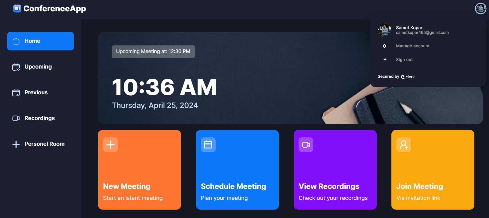
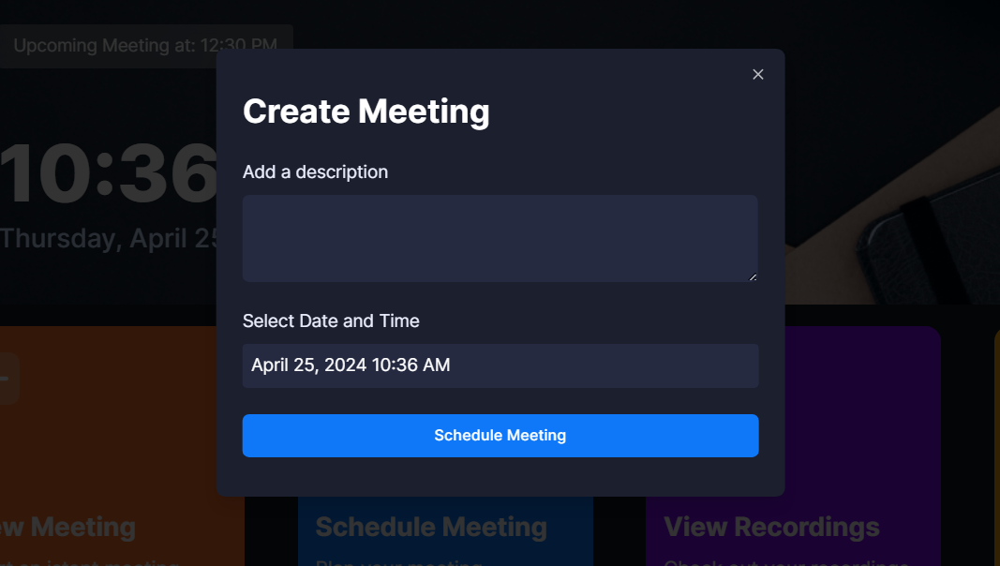
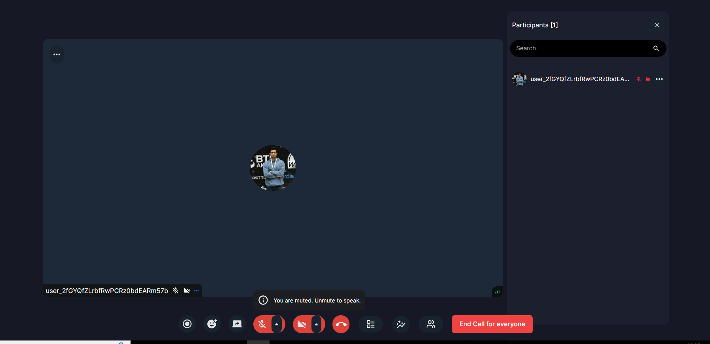
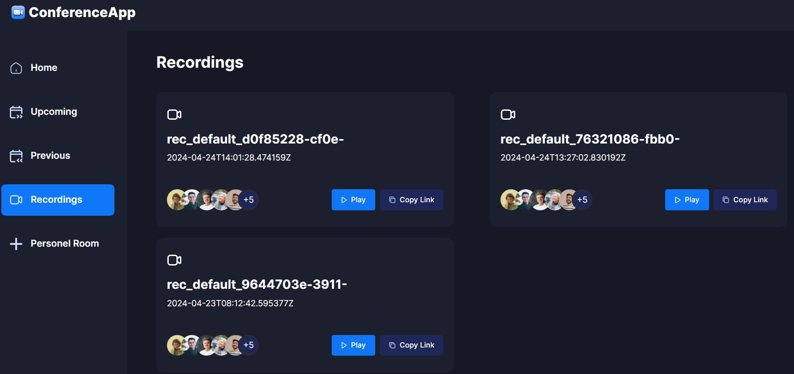
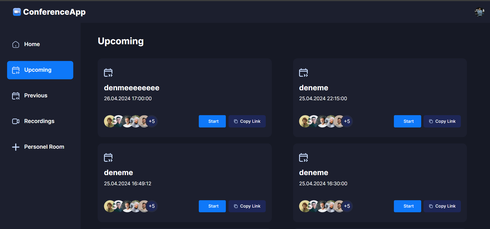
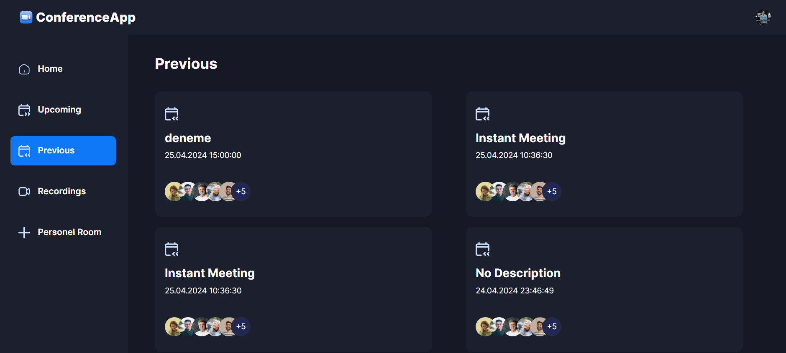
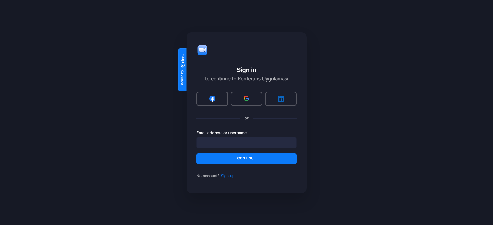

# Conference-App

This Project is a conference application developed using Nextjs 14 and Typscript.

## Technologies Used:
- Nextjs
- Tailwind CSS
- Typescript
- Shadcn/ui
- Clerk
- Stream-io
 

## Getting Started:
To get started with the project, follow these steps:
1. Install project dependencies by running: npm i
2. Start the project by running: npm run dev

## Screenshots:
Below are screenshots of different screens within the project:

    
    
    
    
    
    
    

